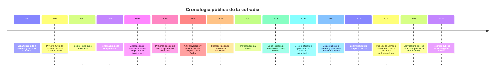

# Informe analítico sobre la Cofradía Jesús Salvador de los Hombres de Montijo

## Resumen ejecutivo

La evidencia pública localizada permite afirmar con bastante solidez que la Cofradía Jesús Salvador de los Hombres, conocida popularmente como **“La Burrita”**, comenzó a organizarse en entity["city","Montijo","badajoz, extremadura, espana"] en **1981**; que en **1987** dio un paso de institucionalización con su primera Junta de Gobierno y la redacción de normas; que su **sede canónica** está en la entity["organization","Parroquia de San Pedro Apóstol de Montijo","montijo, badajoz, espana"]; que la imagen titular actual es una obra seriada de entity["organization","Talleres El Arte Cristiano de Olot","olot, girona, espana"], restaurada en 1998 por entity["people","Luis Peña Maldonado","restaurador llerenense"]; y que los estatutos revisados y actualizados fueron aprobados oficialmente por la entity["organization","Archidiócesis de Mérida-Badajoz","badajoz, extremadura, espana"] en **2019**, mediante decreto firmado por entity["people","Celso Morga Iruzubieta","arzobispo"]. También es claro que la cofradía mantiene actividad cultual y social más allá del Domingo de Ramos, con acciones documentadas como la quema de palmas, campañas solidarias, peregrinaciones y apoyo logístico a streaming parroquial. citeturn9search5turn6view2turn6view3turn11view1turn19search1turn39search13

La investigación exhaustiva en abierto también deja vacíos importantes. **No he localizado** en fuentes públicas abiertas el texto íntegro de los estatutos, libros de actas, inventario completo de enseres, número actualizado de hermanos, una relación pública completa de la Junta actual, ni un teléfono o correo corporativo claramente atribuido a la propia cofradía. Tampoco he encontrado una web independiente de la cofradía: su presencia pública verificable se concentra hoy en entity["company","Facebook","social network"], entity["company","Instagram","social network"] y entity["company","YouTube","video platform"]. citeturn22search0turn22search1turn22search2turn37search5

Las fuentes públicas más útiles y sólidas encontradas han sido: el decreto diocesano de 2019, la web parroquial, la web de los entity["organization","Archivos Eclesiásticos de Mérida-Badajoz","badajoz, extremadura, espana"], la ficha parroquial de la entity["organization","Conferencia Episcopal Española","espana"], la web del entity["organization","Ayuntamiento de Montijo","montijo, badajoz, espana"], la entity["organization","Junta de Extremadura","extremadura, espana"] y varios medios locales y páginas cofrades de ámbito montijano. URLs principales consultadas hoy: `https://www.meridabadajoz.net/?download_id=30659&sdm_process_download=1`; `https://sanpedromontijo.es/`; `https://archivoeclesiastico.meridabadajoz.net/`; `https://www.conferenciaepiscopal.es/parroquias-de-la-diocesis-de-merida-badajoz/`; `https://ayuntamientomontijo.es/`; `https://www.juntaex.es/w/la-junta-invierte-cerca-de-40.000-euros-en-la-restauracion-del-retablo-mayor-de-la-iglesia-de-san-pedro-apostol-de-montijo?inheritRedirect=true`; `https://ventanadigital.com/`; `https://cronicasdeunpueblo.es/` (consulta: 29/04/2026). citeturn11view1turn27search0turn46view0turn28view0turn13search1turn36search0turn19search0

## Qué está verificado y qué sigue abierto

La línea más consistente es esta: **1981** como año de organización o salida de la cofradía; **1987** como momento de formalización orgánica con primera Junta y elaboración de estatutos; **1999** como aprobación arzobispal de los primeros estatutos según fuente histórica local; y **2019** como aprobación oficial, pública y fácilmente verificable de los estatutos revisados conforme al Estatuto Marco diocesano. La coexistencia de 1981 y 1987 no debe leerse necesariamente como error: parece reflejar dos hitos distintos, uno devocional-organizativo y otro jurídico-organizativo. citeturn9search5turn6view2turn11view1

| Asunto | Estado | Observación |
|---|---|---|
| Fundación/organización en 1981 | **Verificado con varias fuentes** | Repetido en pregón, páginas de Semana Santa de Montijo y prensa local. citeturn6view3turn9search5turn19search0 |
| Primera Junta en 1987 | **Verificado en fuente histórica local** | Se citan nombres y el proceso de redacción estatutaria. citeturn6view2turn37search18 |
| Sede canónica en San Pedro Apóstol | **Verificado** | Aparece en pregón, decreto de 2019, canal oficial y directorio eclesial. citeturn6view3turn11view1turn23search0turn28view0 |
| Estatutos aprobados en 2019 | **Verificado oficialmente** | Decreto Prot. 2019/438. citeturn11view1turn10view0 |
| Aprobación de estatutos en 1999 | **Probable, pero no he localizado el documento** | Lo afirma una página histórica local; no apareció el texto del expediente. citeturn6view2 |
| Autoría de la imagen titular | **Verificado de forma convergente** | Olot / El Arte Cristiano; directorio de imaginería y páginas históricas coinciden. citeturn21search0turn21search2turn6view2 |
| Década exacta de la imagen actual | **Parcialmente verificado** | Un vídeo local la sitúa en los años 60, pero no he localizado ficha técnica oficial firmada. citeturn21search3 |
| Hermano Mayor actual y Junta completa | **No verificado por fuente oficial abierta** | Hay nombres parciales en distintas fechas, pero no una relación pública completa y vigente. citeturn37search7turn38search6turn38search12 |
| Número de hermanos | **No localizado** | Sin cifra pública verificable en fuentes abiertas consultadas. |
| Contacto directo de la cofradía | **Incompleto** | Sí hay redes oficiales; no he localizado teléfono/correo corporativo claramente publicado. citeturn22search0turn22search1turn22search2 |

## Historia y cronología

La cofradía aparece públicamente asociada al **Domingo de Ramos** y a la popular “Borriquita” montijana. Las fuentes históricas locales sitúan su arranque organizativo en **1981**, cuando la procesión ya venía precedida por una práctica más antigua de acompañar la jornada con palmas y olivos, pero sin una imagen de la Entrada Triunfal. Ese mismo año se organizó la salida de Jesús a lomos de un pollino, con entity["people","Luis Vega Moreno","fundador montijano"] como encargado, impulsado por el entonces párroco. Años después, en **1987**, se constituyó la primera Junta de Gobierno, se fijó el hábito nazareno actual y se inició el proceso formal de elaboración de estatutos. citeturn9search5turn6view2turn37search18

El patrimonio conocido fue creciendo de manera gradual: el paso de madera se reestrenó en **1991**; la imagen titular fue restaurada en **1998**; la fuente histórica local afirma que los estatutos acabaron siendo aprobados en **1999**; y en **2000** se celebraron las primeras elecciones tras la aprobación estatutaria, con la proclamación de un nuevo Hermano Mayor. En **2006**, con motivo del **XXV aniversario**, la cofradía comenzó a alternar la salida entre San Pedro y entity["organization","Parroquia de San Gregorio Ostiense","montijo, badajoz, espana"] como gesto de unión entre los cristianos de la localidad. citeturn6view2

En la etapa reciente, la cofradía sigue apareciendo activa en el ecosistema religioso y social de la localidad. Hay constancia pública de un musical inspirado en **Jesucristo Superstar** en **2015**; de una peregrinación a entity["city","Fátima","santarem, portugal"] en **2017**; de una cena solidaria a beneficio de entity["organization","Manos Unidas","ong catolica espana"] en **2018**; de la aprobación diocesana de estatutos actualizados en **2019**; del apoyo al streaming parroquial en **2021**; de la continuidad de la Campaña del Kilo en **2023**; y de recorridos públicos, vídeos y cobertura mediática en **2024**, **2025** y **2026**. citeturn20search2turn19search4turn19search1turn11view1turn39search13turn19search9turn20search6turn20search3turn20search0

Las menciones públicas a cargos recientes son fragmentarias. En 2018, una noticia oficial diocesana identifica a entity["people","Mariví Tienza","hermana mayor jhs 2018"] como Hermana Mayor. En 2019, una crónica del pregón identifica a entity["people","Manuel Rodas Llanos","hermano mayor jhs"] entonces como vice Hermano Mayor; en 2022, otra crónica lo cita como Hermano Mayor; y en 2026 vuelve a aparecer como presentador del pregón, “un año más”, ya sin publicarse un organigrama oficial completo. Esto permite reconstruir parcialmente la evolución de cargos, pero no cerrar una foto institucional actual y completa. citeturn37search7turn38search6turn38search12turn38search0

La siguiente cronología resume los hitos más sólidos de la investigación. citeturn9search5turn6view2turn11view1turn19search1turn39search13

URLs principales de esta sección: `https://nazarenoypiedadmontijo.blogspot.com/p/cofradias-de-montijoproximamente.html`; `https://nazarenoypiedadmontijo.blogspot.com/p/pregon-2010.html`; `https://www.meridabadajoz.net/la-cofradia-jesus-salvador-de-los-hombres-de-montijo-ha-recaudad-370-euros-para-manos-unidas/`; `https://www.meridabadajoz.net/peregrinacion-a-fatima-de-la-cofradia-jesus-salvador-de-los-hombres-de-montijo/`; `https://ventanadigital.com/fotosla-cofradia-jesus-salvador-de-los-hombres-represento-el-musical-jesucristo-superstar/`; `https://ventanadigital.com/programa-de-procesiones-y-cultos-de-semana-santa/`; `https://cronicasdeunpueblo.es/art/43617/la-cofradia-jesus-salvador-de-los-hombres-inicia-la-semana-santa-en-montijo` (consulta: 29/04/2026). citeturn6view2turn6view3turn19search1turn19search4turn20search2turn20search0turn19search0

## Imágenes, pasos y patrimonio

La documentación pública abierta identifica **una sola imagen titular actual** de manera clara: **Jesús Salvador de los Hombres**, popularmente “Jesús en la Burrita” o simplemente “La Burrita”. Las fuentes coinciden en que es propiedad de la parroquia, que está realizada en escayola por talleres de Olot y que sustituyó a una imagen anterior retirada por deterioro. El directorio de imaginería de cofradías la atribuye a El Arte Cristiano de Olot y un vídeo local la sitúa en la década de 1960; esta última precisión cronológica debe tomarse como muy probable, pero no cerrada con una ficha técnica oficial accesible. citeturn21search0turn21search2turn21search3turn6view2

| Elemento | Tipo | Autoría / taller | Fecha | Conservación / intervenciones | Ubicación pública conocida | Grado de certeza |
|---|---|---|---|---|---|---|
| Jesús Salvador de los Hombres | Imagen titular | Talleres de Olot / El Arte Cristiano de Olot | s. XX; probablemente década de 1960 | Restaurada en 1998 por Luis Peña Maldonado | En la Ermita de Jesús, en un pequeño altar con dosel desde los primeros años 90 | Alto en autoría y restauración; medio en cronología exacta citeturn21search0turn21search2turn21search3turn21search11turn6view2 |
| Imagen anterior de la “Burrita” | Imagen histórica sustituida | No localizada | No localizada | Retirada por deterioro | Sin ubicación pública conocida | Bajo; sólo consta su sustitución citeturn21search0turn6view2 |
| Paso de Jesús Salvador de los Hombres | Paso procesional | No localizada | Reestrenado en 1991 | Llamador dorado en 2006; faldones de terciopelo verde desde 2000 | Uso procesional en Domingo de Ramos | Medio-alto en cronología; bajo en autoría citeturn6view2 |

Las fuentes históricas publican además algunos detalles de interés: el paso es de madera, de líneas rectas, de una sola altura en los respiraderos, y en la ficha histórica consultada se indica que era portado por **10 hombres** y que el capataz entonces era Domingo Nieto. No he localizado fichas públicas recientes de restauración del paso, ni inventario abierto de insignias, varas, estandarte, túnicas, exorno, llamador, respiraderos, faroles o ajuar complementario. citeturn6view2

En sentido amplio, el patrimonio material vinculado al entorno devocional de la cofradía incluye dos espacios especialmente relevantes. La **Ermita de Jesús** fue descrita por el portal turístico municipal como una ermita-hospital de origen entre finales del XVII y comienzos del XVIII, con pinturas de 1741 e importante retablo barroco; y la parroquia de San Pedro conserva un retablo mayor cuya restauración fue financiada en 2024 por la Junta regional. Estas actuaciones no son patrimonio privativo de la cofradía, pero sí forman parte de su contexto cultual y de su futura narrativa digital. citeturn35search2turn35search3turn35search6turn36search0turn36search6

En material audiovisual sí hay rastros útiles. Existe un canal oficial en YouTube y también vídeos de terceros y de la entity["organization","Revista Semana Santa Montijo","medio local montijo"]. En los materiales revisados **no aparece una licencia expresa** de reutilización; por tanto, deben tratarse como contenidos sujetos a los términos de la plataforma y, salvo autorización expresa, no como imágenes de libre republicación. Enlaces públicos localizados: `https://www.youtube.com/@cofradiajhsmontijo5340`; `https://www.youtube.com/watch?v=S9b9Kvk0qKI`; `https://www.youtube.com/watch?v=DyD--oc04nM`; `https://ventanadigital.com/video-y-fotos-domingo-de-ramos-en-montijo/`; `https://www.youtube.com/channel/UCi2-XA1izxez5f_mKw7zEEA` (consulta: 29/04/2026). citeturn22search2turn23search1turn23search2turn20search6turn24search3

## Actividad cultual, social y presencia pública

El núcleo cultual público documentado en abierto es el **Domingo de Ramos**. La cofradía abre los desfiles procesionales de la Semana Santa montijana y su salida se integra en la bendición de ramos y la Eucaristía. La fuente histórica local explica que es la única procesión de Montijo insertada dentro de la liturgia del Domingo de Ramos y que, desde 2006, alterna el eje San Gregorio–San Pedro y San Pedro–San Gregorio. Esa alternancia aparece confirmada en itinerarios y crónicas recientes: en 2017 salió de San Pedro hacia San Gregorio; en 2024 de San Gregorio a San Pedro; en 2025 volvió a figurar la salida desde San Pedro; y en 2026, de nuevo, se publicó el recorrido desde San Gregorio hasta San Pedro. citeturn6view2turn19search3turn19search0turn20search3turn20search0

El calendario anual públicamente detectable, sin pretender suplir un calendario interno que no está publicado, queda así:

| Época del año | Acto o actividad localizada | Base pública |
|---|---|---|
| Febrero | Quema de palmas y ramos del Domingo de Ramos anterior | citeturn15search0turn15search3turn15search4turn22search6 |
| Cuaresma / pre-Semana Santa | Actos culturales y de convivencia; en 2015, montaje de *Jesucristo Superstar* | citeturn20search2 |
| Domingo de Ramos | Bendición de ramos, procesión y misa | citeturn6view2turn6view3turn20search0turn20search3 |
| Cuaresma / Semana Santa | Apoyo técnico al streaming parroquial en 2021 | citeturn39search13turn23search3turn23search5 |
| Primavera | Peregrinación a Fátima documentada en 2017 | citeturn19search4 |
| Primavera | Cena solidaria a beneficio de Manos Unidas en 2018, preparada por el proyecto “Jóvenes” | citeturn19search1turn6view4 |
| Noviembre | Convocatoria oficial en redes para celebrar Cristo Rey en 2025 | citeturn14search0 |
| Adviento / Navidad | Campaña del Kilo a beneficio de Cáritas Montijo, reiterada en 2023 | citeturn19search9 |
| Quinario / besamanos propios | **No localizados en abierto** para esta cofradía | No verificado en fuentes consultadas |

En el plano social, la cofradía aparece como una entidad con una dimensión juvenil bastante visible. La noticia diocesana sobre Manos Unidas habla expresamente del **proyecto “Jóvenes”**; las redes sociales oficiales muestran continuidad en convocatorias; y la ayuda al streaming parroquial en 2021 apunta a una cofradía implicada también en tareas técnicas y de servicio. Todo ello sugiere un perfil más amplio que el de una cofradía exclusivamente procesional de un solo día. citeturn19search1turn22search0turn22search1turn39search13

La presencia pública digital hoy es real, pero dispersa. La página oficial de Facebook se presenta como la “**Página oficial de la Cofradía Jesús Salvador de los Hombres de Montijo**”. En Instagram figura como **@cofradiajhs** y el propio snippet público la describe como “Cofradía J.H.S Montijo (Badajoz)” con seguidores visibles en la consulta; en YouTube existe el canal **Cofradía JHS Montijo**, definido como el canal de la cofradía con sede canónica en San Pedro. Además, la Revista Semana Santa Montijo funciona como amplificador importante de vídeos, pregones y cartelería relacionada. URLs públicas principales: `https://www.facebook.com/cofradiajhs/`; `https://www.instagram.com/cofradiajhs/`; `https://www.youtube.com/@cofradiajhsmontijo5340`; `https://www.facebook.com/RevistaSemanaSantaMontijo/`; `https://www.instagram.com/revistasemanasantamontijo/`; `https://www.youtube.com/channel/UCi2-XA1izxez5f_mKw7zEEA` (consulta: 29/04/2026). citeturn22search0turn22search1turn22search2turn25search0turn24search2turn24search3

## Archivo, documentos, registros y contactos

El documento oficial más importante localizado es el **decreto de aprobación de estatutos** de 2019. El Boletín oficial diocesano consigna que la Junta Directiva de la cofradía, radicada en la parroquia de San Pedro Apóstol de Montijo, presentó sus estatutos revisados y actualizados; y que quedaron aprobados con **Prot. 2019/438**, fechado en Badajoz el **3 de mayo de 2019**. Este es, a día de hoy, el mejor anclaje documental abierto y primario para cualquier ficha histórica seria de la corporación. URL: `https://www.meridabadajoz.net/?download_id=30659&sdm_process_download=1` (consulta: 29/04/2026). citeturn11view1turn10view0

No he localizado el texto íntegro de los estatutos en abierto, ni el expediente completo, ni las actas de cabildo o de elecciones. Sí he localizado, en cambio, la indicación oficial de que los fondos parroquiales custodiados por los Archivos Eclesiásticos de Mérida-Badajoz incluyen **hermandades y cofradías**, ermita, libros de fábrica, padrones y otros documentos; además, el portal de registros parroquiales confirma la existencia de series históricas de Montijo. Eso convierte al archivo eclesiástico en el punto probablemente más fértil para reconstruir historia institucional, economía y culto. URLs: `https://archivoeclesiastico.meridabadajoz.net/archivos-parroquiales/`; `https://archivoeclesiastico.meridabadajoz.net/registros-parroquiales/`; `https://archivoeclesiastico.meridabadajoz.net/archivo-diocesano/` (consulta: 29/04/2026). citeturn50search0turn50search1turn50search2

En cuanto a registros oficiales civiles o estatales, **no he podido verificar** en abierto un asiento oficial del Registro de Entidades Religiosas con número de inscripción. La única pista localizada fue un directorio temático que alude al Registro de Entidades Religiosas, pero sin aportarme un identificador contrastable desde una fuente oficial abierta del Estado. Por ello, ese extremo debe considerarse **no verificado** hasta consulta directa a la propia cofradía, a la archidiócesis o al ministerio competente. citeturn7search0turn8search1

Para trabajo presencial o petición formal de documentación, estos son los contactos más útiles que la investigación ha podido fijar con seguridad razonable:

| Centro / fuente presencial | Qué pedir allí | Datos de contacto públicos | Horario público localizado |
|---|---|---|---|
| Parroquia de San Pedro Apóstol de Montijo | Expedientes parroquiales, papelería de cultos, posibles libros de hermandad, copias de estatutos o de edictos, fotografías, carteles, hojas litúrgicas | Plaza Campo de la Iglesia, 1; teléfono 924454629; formulario web en `https://sanpedromontijo.es/habla-que-te-escuchamos/` | No he localizado horario de atención documental específico citeturn27search5turn28view0turn26view0 |
| Parroquia de San Gregorio Ostiense | Itinerarios, avisos de salida/entrada alterna, posible documentación litúrgica o fotográfica de la salida interparroquial | Huerta de los Frailes, 8 bajo; teléfono 924452502 | No he localizado horario de atención documental específico citeturn28view0turn27search1 |
| Archivos Eclesiásticos de Mérida-Badajoz | Series parroquiales de Montijo, documentos de hermandades y cofradías, expedientes y registros históricos | C/ Obispo San Juan de Rivera, 13, 06002 Badajoz; teléfono 924201461; correo `archivodiocesano@archimeridabadajoz.org`; `https://archivoeclesiastico.meridabadajoz.net/contacto/` | Miércoles y jueves de 11:30 a 14:30, con cita previa obligatoria citeturn45view0turn46view0 |
| Ayuntamiento de Montijo | Permisos, subvenciones, cartelería, hemeroteca municipal, expedientes de Semana Santa, relaciones con Junta de Hermandades y cofradías | Plaza de España, 1; teléfono 924455693; `https://ayuntamientomontijo.es/` | Existe un documento municipal de horario de atención, pero no he abierto su contenido; confirmar previamente por teléfono citeturn13search1turn49search1 |
| Biblioteca Pública Municipal María Jesús Rodríguez Villa | Prensa local, revistas, posible apoyo para localizar el archivo histórico municipal o colecciones localistas | C/ San Antonio, 12; teléfono 924456085; correo `montijo@biblio.juntaex.es` | Lunes a viernes de 09:00 a 14:00 y de 16:00 a 20:30; verano de 08:00 a 15:00, según el directorio estatal de bibliotecas citeturn44search0turn48search0turn48search1turn42search2 |

Además de lo presencial, es importante anotar que el **Archivo Digital de la Diputación de Badajoz** ofrece acceso a documentación municipal digitalizada y que la propia Diputación identifica expresamente el “Archivo Municipal de Montijo” dentro de esos fondos. Esto no sustituye la consulta de papeles de cofradía, pero sí puede ayudar a localizar menciones en actas plenarias, cesiones, subvenciones, uso del espacio público o colaboración institucional. URL: `https://www.dip-badajoz.es/cultura/archivo/index.php?seleccion=_digital` (consulta: 29/04/2026). citeturn30search2turn32search0

## Recomendaciones prioritarias para la web y la digitalización

La conclusión más clara de esta investigación es que **la cofradía necesita una web propia** o, al menos, una microsite robusta en dominio parroquial o municipal. Hoy la información está muy repartida entre Facebook, Instagram, YouTube, prensa local y páginas históricas de terceros. Eso perjudica la verificación documental, la memoria institucional, el posicionamiento local y la captación de hermanos, donantes y público joven. citeturn22search0turn22search1turn22search2turn19search0turn20search6

La prioridad alta debería centrarse en **estructura, autoridad y consulta pública**. La portada tendría que resolver en un vistazo cuatro necesidades: quiénes somos, próximo culto o procesión, cómo contactar, y cómo colaborar. Debajo, la arquitectura mínima recomendable sería: **Historia**, **Cultos y calendario**, **Patrimonio**, **Noticias**, **Caridad y juventud**, **Archivo digital**, **Zona de hermanos**, **Contacto** y **Donaciones**. El mayor valor no estaría en “tener una web”, sino en **convertirse en la fuente primaria de referencia** para la propia historia de la cofradía. citeturn6view2turn6view3turn11view1turn19search1

Una propuesta concreta y priorizada sería esta:

| Prioridad | Qué introducir | Por qué aporta valor |
|---|---|---|
| Muy alta | Página de inicio con agenda, cartel, recorrido, aviso meteorológico, botón de directo y contacto | Resuelve la necesidad práctica del vecino y del hermano en Cuaresma y Semana Santa |
| Muy alta | Sección **Historia** con timeline, lista de Hermanos Mayores, hitos, documentos escaneados y fotografías antiguas | Fija versión oficial y evita la dispersión actual |
| Muy alta | Sección **Patrimonio** con fichas de imagen, paso, enseres, hábitos y restauraciones | Hoy no existe un inventario público claro |
| Alta | Calendario anual con exportación a Google Calendar / iCal y PDF imprimible | Mejora muchísimo la asistencia y la organización |
| Alta | **Zona de hermanos** con alta/baja, cuotas, actualización de datos, certificados, normativa y elecciones | Profesionaliza la gestión interna |
| Alta | Página de **Donaciones** con Bizum, transferencia y TPV seguro, explicando destino de fondos | Facilita caridad, restauración y mantenimiento |
| Alta | Integración del canal de YouTube y archivo de retransmisiones | Ya existe una base de streaming que conviene ordenar |
| Alta | Archivo multimedia con fotografías, vídeos, carteles, pregones y hojas litúrgicas | Hoy ese material está desperdigado |
| Media | SEO local con títulos claros: “Cofradía Jesús Salvador de los Hombres de Montijo” | Hará que la información oficial aparezca antes que la de terceros |
| Media | Versión móvil cuidada y accesible | Gran parte del uso vendrá del móvil y desde WhatsApp / redes |
| Media | Página de transparencia básica: estatutos, junta, delegaciones, protección de datos y política de menores | Aumenta confianza y reduce fricción |
| Media | Formulario de cesión de fotos y memorias antiguas por parte de hermanos | Ayuda a construir archivo histórico participativo |

En SEO local y descubribilidad, la web debería trabajar expresamente combinaciones como **“Cofradía Jesús Salvador de los Hombres Montijo”**, **“La Burrita Montijo”**, **“Domingo de Ramos Montijo”**, **“recorrido Domingo de Ramos Montijo”** y **“Semana Santa Montijo cofradía JHS”**. Además, conviene usar marcado semántico tipo *Organization*, *Place* y *Event*, una ficha geolocalizada, metadatos Open Graph para compartir en WhatsApp, y títulos de página que no dependan solo de imágenes o carteles. Las redes sociales ya existentes sirven como canales de distribución; la web debe ser el repositorio canónico. citeturn22search0turn22search1turn22search2turn20search0turn20search3

En accesibilidad y experiencia móvil, la vara de medir debería ser **WCAG 2.2 AA**: contraste suficiente, tipografía escalable, navegación por teclado, textos alternativos en imágenes, subtítulos en vídeo, cartelería descargable en PDF accesible, botones grandes y menús simples. En una cofradía donde buena parte del público es intergeneracional, esto no es un “extra”; es una parte del servicio pastoral y comunitario. citeturn20search6turn39search13

La parte de digitalización del archivo no debería empezar por “subir fotos”, sino por **ordenar y describir**. La secuencia recomendable es: identificación de series documentales; cuadro de clasificación; inventario con signaturas; digitalización máster en TIFF a 400–600 ppp; copias de acceso en JPEG/PDF; metadatos mínimos; copias de seguridad 3-2-1; y control de permisos de difusión. Las primeras series candidatas a digitalización serían: estatutos y reglamentos; actas; libros de cuentas; convocatorias y censos; carteles; fotografías; recortes de prensa; hojas de cultos; pregones; programas de mano; y testimonios orales de fundadores y antiguos costaleros. Esta estrategia encaja especialmente bien con la existencia de fondos parroquiales y documentales de hermandades en el archivo eclesiástico. citeturn50search0turn50search2turn11view1

Un proyecto especialmente valioso sería crear un **archivo oral de la cofradía**. La historia pública depende hoy en gran parte de piezas dispersas y de memoria viva. Un pequeño programa de entrevistas en vídeo o audio a fundadores, antiguos hermanos mayores, costaleros veteranos, personas vinculadas al proyecto joven y fotógrafos locales permitiría preservar datos que probablemente no están todavía en soporte escrito ordenado. Este material, bien catalogado, daría un salto enorme a la futura web. citeturn37search18turn37search14turn19search11

## Lagunas y siguientes pasos presenciales

Las principales lagunas de información pública son seis. La primera es la **composición completa y vigente de la Junta de Gobierno**. La segunda, el **número de hermanos** y la evolución de altas/bajas. La tercera, el **texto íntegro de los estatutos** y de sus versiones anteriores. La cuarta, el **inventario completo de patrimonio y enseres**. La quinta, el **asiento oficial en algún registro estatal accesible en abierto**, si efectivamente existe con número publicable. Y la sexta, la identificación de **documentación histórica primaria** propia de la cofradía fuera del decreto de 2019. citeturn11view1turn22search0turn50search0

Para cerrar esas lagunas, los pasos con mejor relación esfuerzo/resultado serían los siguientes. Primero, solicitar cita en los Archivos Eclesiásticos y pedir específicamente **series de hermandades y cofradías de Montijo**, buscando expedientes, inventarios, traslados de fondos y cualquier carpeta relativa a Jesús Salvador de los Hombres. Segundo, pedir en la parroquia copia o consulta de **estatutos, edictos de elecciones, inventarios y papelería histórica**. Tercero, revisar en la biblioteca y en el archivo digital de Diputación la **hemeroteca local** y las **actas municipales** de años clave: 1981, 1987, 1991, 1998, 2006, 2019 y 2024. Cuarto, contactar por mensaje directo con las redes oficiales para solicitar una relación actualizada de cargos y un correo operativo. Quinto, entrevistar a responsables y antiguos responsables públicamente citados en la documentación disponible, como Manuel Rodas, Mariví Tienza o familiares de Luis Vega Moreno, además de redactores de la Revista Semana Santa Montijo. citeturn45view0turn26view0turn30search2turn22search0turn22search1turn37search18turn37search7turn38search12

En síntesis, la cofradía **sí tiene una huella pública suficiente para construir una historia base muy sólida**, pero **todavía no posee una presencia digital unificada ni un archivo en abierto que la represente con autoridad**. Precisamente ahí está la mayor oportunidad: si convierte en web oficial todo lo que hoy existe de forma fragmentaria, y si ordena su archivo histórico con método, puede pasar en poco tiempo de ser una cofradía “visible en redes” a ser una cofradía **documentada, localizable, verificable y digitalmente preservada**. citeturn22search0turn22search1turn22search2turn11view1turn50search0